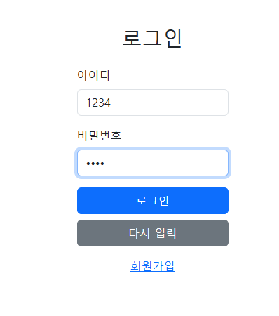
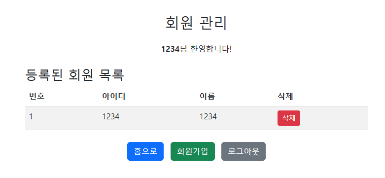
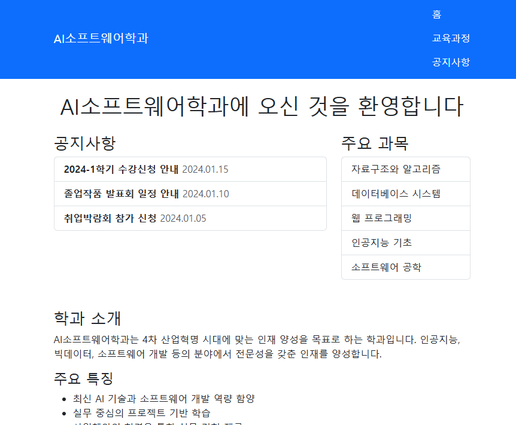

# JSP 웹 프로젝트

JSP와 Bootstrap으로 만든 웹 페이지 실습 프로젝트입니다.  
회원가입, 로그인, 회원 관리, 로그아웃까지 기본적인 웹 흐름이 이어지도록 구성했습니다.

## 주요 흐름

- `project_intro.jsp`: 프로젝트 소개
- `login.jsp`: 로그인 입력 화면
- `signup_form.jsp`: 회원가입 입력 화면
- `check_id_availability.jsp`: 아이디 중복 확인
- `signup_process.jsp`: 회원가입 처리
- `login_process.jsp`: 로그인 처리
- `login_result.jsp`: 로그인 결과 확인
- `member_dashboard.jsp`: 회원 목록과 관리 화면
- `delete_member.jsp`: 회원 삭제 처리
- `logout.jsp`: 로그아웃 처리
- `department_home.jsp`: 메인 홈 화면
- `curriculum_overview.jsp`: 커리큘럼 소개 화면
- `notice_board.jsp`: 공지 화면

## 화면 예시

### 로그인 화면

### 회원 관리 화면

### 메인 홈 화면

실행 화면 예시를 함께 넣어 두어서, 로그인 흐름과 회원 관리 화면 구성을 GitHub에서도 바로 확인할 수 있습니다.

## 보면 좋은 부분

- 회원가입과 로그인 흐름이 페이지별로 나뉘어 있는 점
- `application` scope로 회원 정보를 관리한 방식
- `session` scope로 로그인 상태를 처리한 방식
- 파일 이름만 봐도 역할을 알 수 있게 정리한 점

## 사용 기술

- `JSP`
- `Java`
- `Bootstrap`
