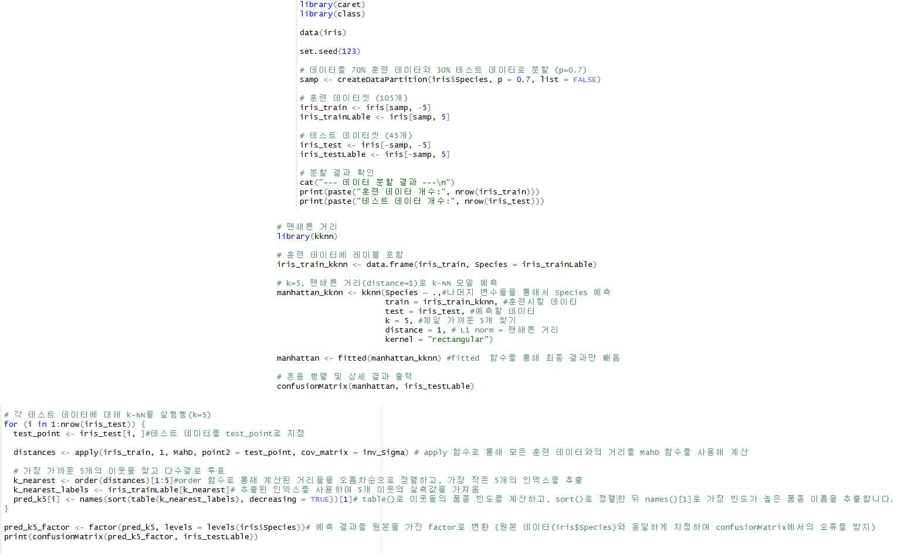
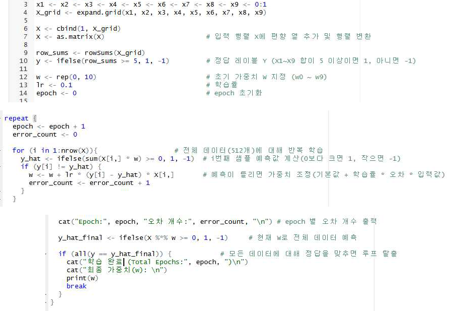
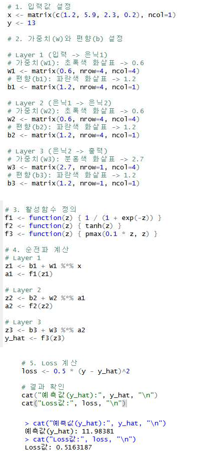

# 머신러닝 포트폴리오

R로 정리한 머신러닝 실습 코드 모음입니다.  
파일이 한 번에 너무 많이 보이지 않도록 `분류`, `회귀`, `신경망`, `기초 개념` 기준으로 다시 나누었습니다.

## 폴더 안내

### `분류/`
- `knn_distance_comparison.R`
- `logistic_vs_knn.R`
- `kernel_svm.R`

분류 문제에서 거리 기반 방법, 로지스틱 회귀, SVM을 비교하는 코드가 들어 있습니다.

### `회귀/`
- `linear_vs_tree.R`
- `random_forest.R`

회귀 문제에서 선형회귀, 의사결정나무, 랜덤 포레스트를 비교하는 코드가 들어 있습니다.

### `신경망/`
- `backpropagation.R`
- `neural_network_forward.R`
- `neural_network_regression.R`

순전파, 역전파, 신경망 기반 회귀처럼 신경망 관련 실습을 모아두었습니다.

### `기초개념/`
- `margin_perceptron.R`
- `perceptron_learning.R`
- `information_gain.R`

퍼셉트론 학습, 정보이득 계산처럼 기본 개념을 확인하는 코드가 들어 있습니다.

## 실행 결과 예시

### k-NN 결과 화면

### 퍼셉트론 학습 화면

### 신경망 결과 화면

실행 결과 예시를 함께 넣어 두어서, 코드만 보는 것보다 출력값과 결과 해석 흐름을 더 쉽게 확인할 수 있습니다.

## 보면 좋은 부분

- 분류, 회귀, 신경망 코드가 어떻게 나뉘어 있는지
- `Accuracy`, `MSE`, `R^2`, `Loss` 같은 기본 지표를 어떻게 확인하는지
- 실습 코드를 GitHub에서 읽기 쉽게 다시 정리한 방식

## 참고

- 일부 코드는 `caret`, `class`, `kknn`, `nnet`, `e1071`, `rpart`, `randomForest`, `FSelector` 패키지를 사용합니다.
- 실습 데이터가 필요한 스크립트는 별도의 `.RData` 파일을 전제로 작성되어 있습니다.
