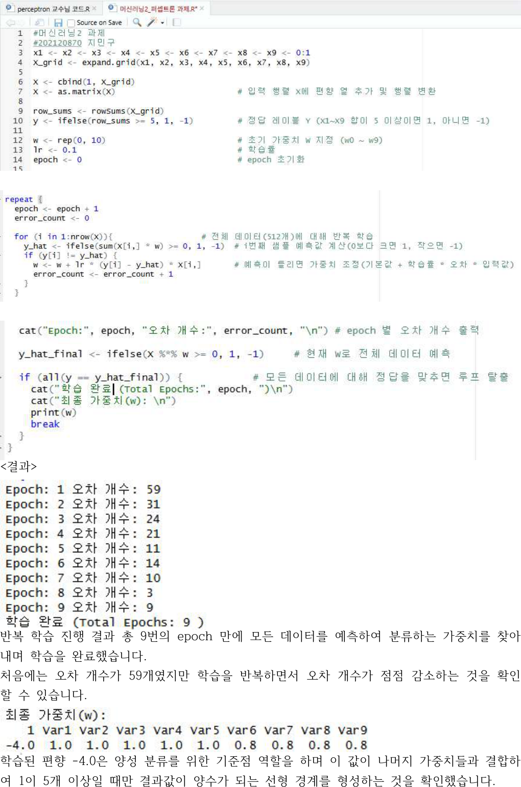
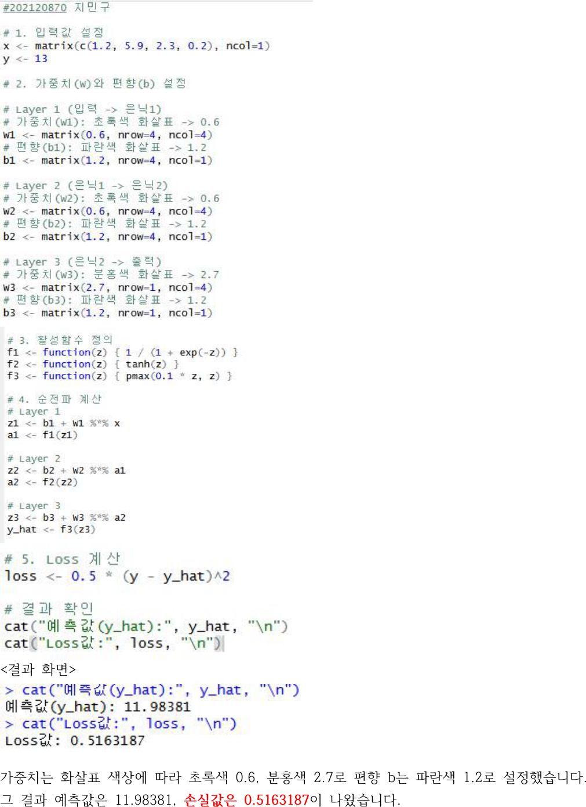
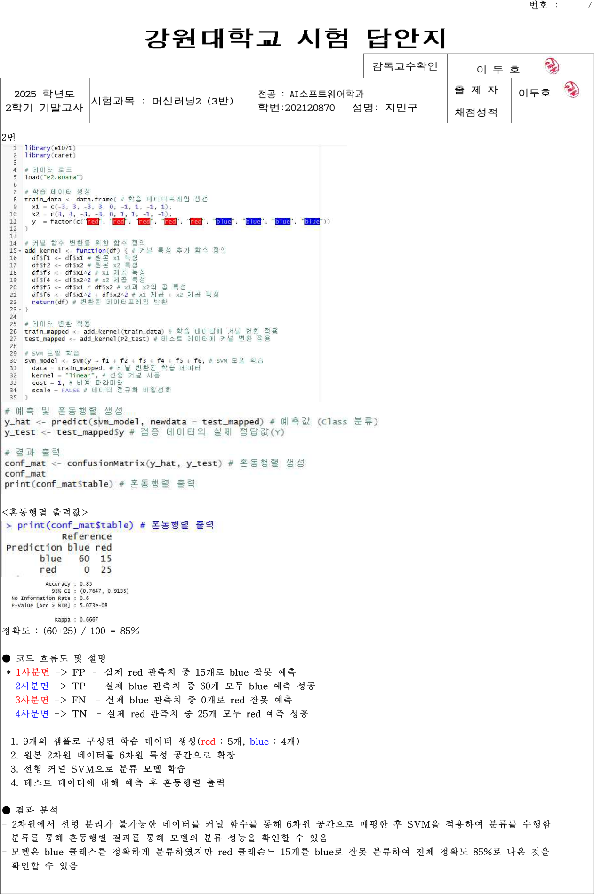

# Machine Learning Portfolio

R로 정리한 머신러닝 실습 코드 모음입니다.  
분류, 회귀, 퍼셉트론, 신경망 기초 실습을 파일별로 나눠 두었고, 각 코드가 어떤 값을 출력하는지와 그 의미를 README에서 함께 볼 수 있게 정리했습니다.

## Included Scripts

- `knn_distance_comparison.R`: 거리 계산 방식에 따라 k-NN 정확도가 어떻게 달라지는지 비교
- `logistic_vs_knn.R`: 로지스틱 회귀와 k-NN 분류 결과 비교
- `kernel_svm.R`: 특성 확장을 적용한 선형 커널 SVM 분류
- `linear_vs_tree.R`: 선형회귀와 의사결정나무 회귀의 MSE 비교
- `random_forest.R`: 랜덤 포레스트 회귀의 R^2, MSE, 변수 중요도 확인
- `margin_perceptron.R`: 마진 퍼셉트론의 가중치 업데이트 과정 계산
- `neural_network_regression.R`: 선형회귀와 직접 구현한 신경망 회귀 비교
- `backpropagation.R`: 역전파를 통한 가중치 갱신 과정 정리
- `perceptron_learning.R`: epoch에 따른 퍼셉트론 학습 흐름 확인
- `information_gain.R`: 정보이득 계산을 통한 변수 중요도 확인
- `neural_network_forward.R`: 순전파와 loss 계산 과정 정리

## Preview

### 출력 지표 예시

| 파일 | 확인할 값 |
| --- | --- |
| `knn_distance_comparison.R` | Accuracy, confusion matrix |
| `logistic_vs_knn.R` | 두 모델의 Accuracy 비교 |
| `kernel_svm.R` | confusion matrix |
| `linear_vs_tree.R` | 선형회귀 MSE, 의사결정나무 MSE |
| `random_forest.R` | `R^2`, `MSE`, 변수 중요도 |
| `margin_perceptron.R` | 단계별 가중치 업데이트 값 |
| `neural_network_regression.R` | 선형회귀 `R^2`, 신경망 `R^2` |
| `backpropagation.R` | 최종 출력값 `y_hat` |
| `perceptron_learning.R` | epoch별 오분류 수, 최종 가중치 |
| `information_gain.R` | 변수별 information gain |
| `neural_network_forward.R` | 예측값 `y_hat`, loss |

### 실행 결과 예시
#### k-NN 결과 화면

#### SVM 결과 화면

#### 신경망 결과 화면

PDF에 정리해둔 실제 실행 결과 화면을 기준으로 넣은 이미지라서, 코드만 보는 것보다 출력값과 결과 해석 흐름을 더 쉽게 확인할 수 있습니다.

## What To Look At

- `Accuracy`, `MSE`, `R^2`, `Loss` 같은 기본 지표 해석
- 모델별 출력값이 무엇을 의미하는지 설명을 붙인 점
- 실습 코드를 GitHub에서 읽기 쉽게 다시 정리한 점

## Notes

- 일부 코드는 `caret`, `class`, `kknn`, `nnet`, `e1071`, `rpart`, `randomForest`, `FSelector` 패키지를 사용합니다.
- 실습 데이터가 필요한 스크립트는 별도의 `.RData` 파일을 전제로 작성되어 있습니다.
