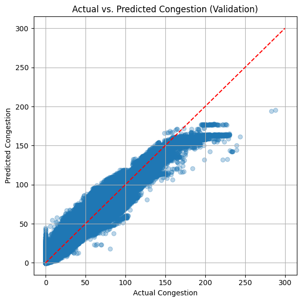
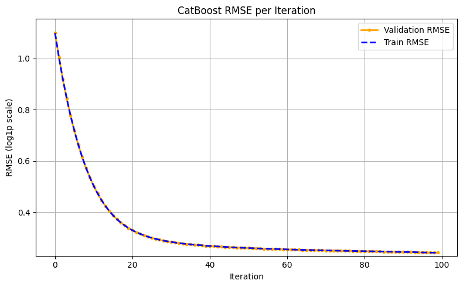
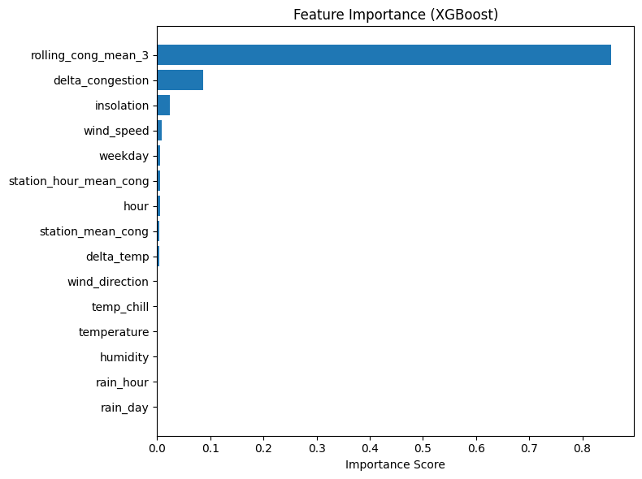
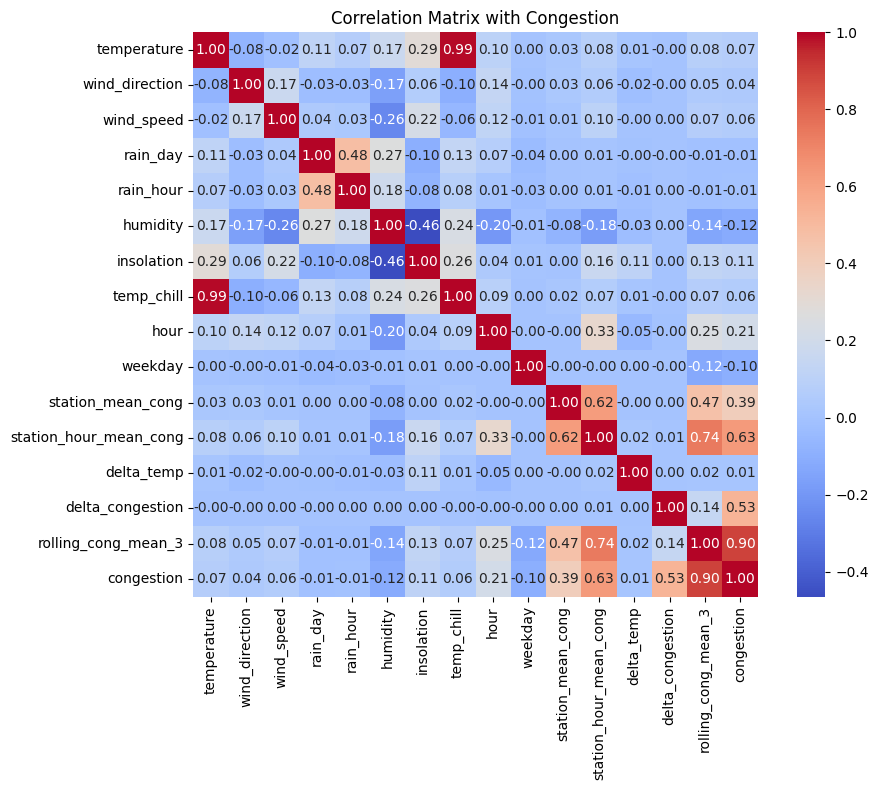

# Weather and Subway Crowding Analysis

날씨와 지하철 혼잡도의 관계를 살펴본 데이터 분석 프로젝트입니다.  
공공데이터를 활용해 주제를 정하고, 데이터를 정리한 뒤 분석 과정을 노트북으로 남겼습니다.

## File

- `분석 프로그램 코드.ipynb`

## What This Project Covers

- 분석 주제를 정하고 데이터를 불러오는 과정
- 날씨 변화와 혼잡도의 관계를 확인하려는 시도
- 결과를 코드와 함께 노트북 형태로 정리한 흐름

## Result Summary

- 검증 기준 `MAE`: `1.7951`
- 검증 기준 `R^2`: `0.9732`
- 검증 기준 `RMSE`: `3.1501`

예측값이 실제 혼잡도와 전반적으로 비슷한 흐름을 보였고, 기상 변수와 시간 정보가 혼잡도 예측에 의미 있게 작용하는지 확인할 수 있었습니다.

## Output Preview

### 예측값과 실제값 비교

### CatBoost 학습 추이

### 변수 중요도

### 상관관계 히트맵

## Environment

- `Python`
- `Jupyter Notebook`
