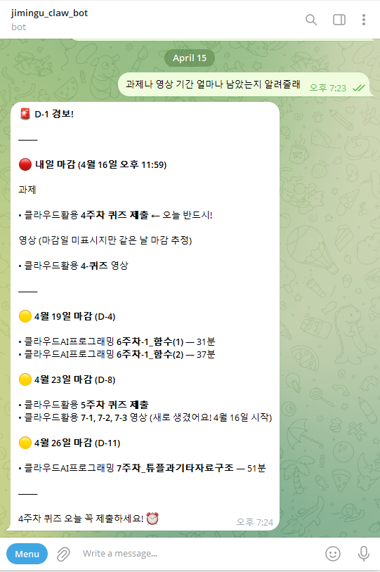
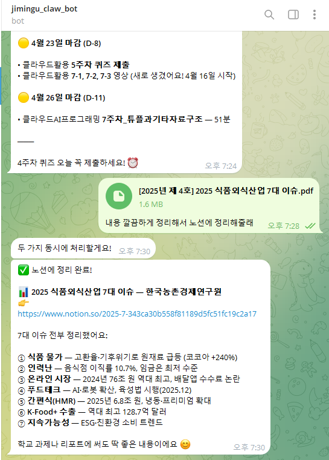
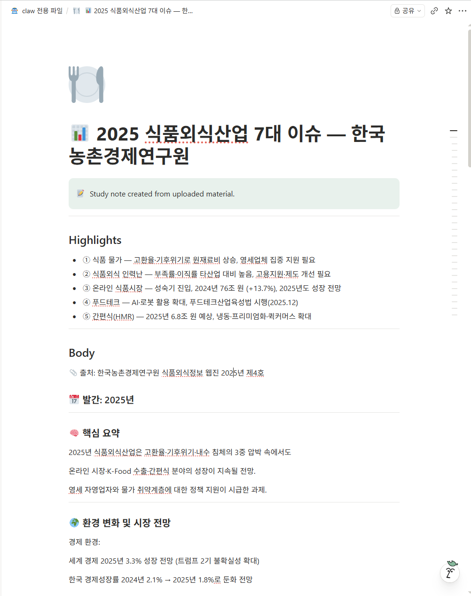

# Study Workflow Assistant

OpenClaw 기반으로 구현한 개인용 학습 관리 자동화 플러그인입니다.  
학교 포털에 흩어져 있는 과제 마감 정보와 강의 진행 현황을 한 번에 정리하고, 업로드한 학습 자료를 요약한 뒤 노션 페이지로 다시 구조화하는 흐름에 초점을 맞췄습니다.

반복적으로 포털을 열어 확인해야 하는 작업을 줄이고,  
그날 바로 확인해야 할 일정과 자료를 더 빠르게 정리할 수 있도록 구성했습니다.

## 프로젝트 소개

대학교 생활에서는 과제 마감, 온라인 강의, 학습 자료, 정리 문서가 서로 다른 화면과 파일에 흩어져 있는 경우가 많습니다.  
이 프로젝트는 이런 정보를 한 번에 모아 보고, 필요한 내용만 빠르게 요약해 텔레그램 메시지나 노션 페이지 형태로 다시 정리할 수 있도록 만든 보조 프로젝트입니다.

단순한 크롤링 스크립트가 아니라,

- 학교 포털에서 일정과 진행 현황을 수집하고
- SQLite에 상태를 저장한 뒤
- 데일리 리포트와 자료 요약을 생성하고
- 노션 페이지로 정리 결과를 다시 발행하는

하나의 학습 관리 워크플로우로 설계했습니다.

## 해결하려고 한 문제

### 1. 과제와 강의 마감 정보를 매번 다시 확인해야 하는 문제

학교 포털의 여러 페이지를 반복해서 열어보지 않으면  
무엇이 급한지 바로 파악하기 어려웠습니다.  
그래서 포털에서 일정 정보를 읽어와, 임박한 과제와 강의 항목만 따로 묶어 보여주도록 구성했습니다.

### 2. 학습 자료가 PDF, HWP, TXT처럼 여러 형식으로 흩어져 있는 문제

수업 자료와 보고서 참고 문서는 파일 형식이 제각각이라  
다시 요약하거나 정리해 활용하기 번거로웠습니다.  
여러 형식의 파일에서 텍스트를 추출하고, 핵심 내용을 다시 정리 가능한 형태로 바꾸는 흐름을 만들었습니다.

### 3. 메모와 리포트 정리가 다른 도구로 분리되어 있는 문제

포털에서 확인한 일정과 업로드한 자료 요약을 따로따로 정리하면 흐름이 끊기기 쉬웠습니다.  
이 프로젝트는 노션 발행 기능까지 연결해, 정리 결과를 바로 문서화할 수 있도록 구성했습니다.

## 핵심 기능

### 1. 학교 포털 일정 동기화

- 학교 포털에서 과제와 강의 항목을 읽어옵니다.
- 완료되지 않은 항목을 기준으로 현재 확인이 필요한 내용만 다시 정리합니다.
- 최신 스냅샷을 로컬 SQLite에 저장해 이후 리포트 생성에 활용합니다.

### 2. 데일리 학습 리포트 생성

- 남은 과제, 임박한 마감, 확인이 필요한 강의 항목을 한 번에 묶어 일일 리포트를 생성합니다.
- 텔레그램으로 바로 전달할 수 있는 간결한 텍스트 형식으로 결과를 정리합니다.
- 필요하면 같은 내용을 노션 페이지로도 함께 저장할 수 있습니다.

### 3. 학습 자료 요약 및 구조화

- PDF, TXT, Markdown, JSON, CSV, HWP 형식의 학습 자료를 읽어 텍스트를 추출합니다.
- 자료별 핵심 내용, 요약 포인트, 재활용 가능한 정리 문장을 함께 생성합니다.
- 여러 개의 파일을 한 번에 묶어 정리하는 흐름도 지원합니다.

### 4. 노션 페이지 자동 정리

- 요약 결과를 노션 페이지 형식으로 발행할 수 있습니다.
- 노트형, 과제형, 강의형 템플릿을 분리해 목적에 맞게 내용을 정리합니다.
- 첨부 파일과 핵심 bullet을 함께 남겨 이후 복습용 문서로 다시 활용할 수 있게 했습니다.

## 구현 포인트

- OpenClaw 플러그인 구조 위에 학습 관리 보조 기능을 직접 설계하고 구현했습니다.
- 학교 포털별 차이를 반영할 수 있도록 URL과 selector를 별도 설정 파일로 분리했습니다.
- SQLite 기반 상태 저장을 적용해 최신 스냅샷과 완료 여부를 추적할 수 있게 했습니다.
- 텔레그램용 메시지와 노션용 페이지 레이아웃을 분리해 같은 데이터를 목적에 맞게 다르게 가공했습니다.
- PDF와 HWP 같은 학습 자료는 형식별 추출 로직을 분리해 재사용 가능한 ingest 흐름으로 정리했습니다.

## 프로젝트 구조

- `index.ts`
  - OpenClaw 플러그인 진입점
- `src/tool-campus-sync.ts`
  - 학교 포털에서 과제와 강의 항목을 수집하는 도구
- `src/tool-morning-report.ts`
  - 마감 일정 중심 데일리 리포트를 생성하는 도구
- `src/tool-study-material-ingest.ts`
  - 학습 자료에서 텍스트를 추출하고 요약 결과를 만드는 도구
- `src/tool-notion-publish.ts`
  - 정리된 결과를 노션 페이지로 발행하는 도구
- `src/school-portal.ts`
  - 학교 포털 로그인, 목록 수집, selector 기반 파싱 로직
- `src/state-db.ts`
  - SQLite 기반 스냅샷 저장 및 상태 관리
- `src/notion-api.ts`, `src/notion-layout.ts`
  - 노션 페이지 생성 및 레이아웃 구성
- `src/file-ingest.ts`
  - 파일 형식별 텍스트 추출 및 자료 요약 로직
- `examples/school-portal.example.json`
  - 포털 selector 설정 예시

## 실행 화면

실행 화면은 `마감 일정 요약 → 노션 정리 완료 안내 → 최종 노션 페이지` 흐름으로 확인할 수 있도록 배치했습니다.

### 1. 과제와 강의 마감 요약 리포트

텔레그램 메시지 형식으로 임박한 과제와 강의 항목을 우선순위 기준으로 정리한 화면입니다.  
당장 확인이 필요한 일정이 먼저 보이도록 구성했고, 마감일까지 남은 기간도 함께 확인할 수 있습니다.

### 2. 노션 정리 완료 메시지

업로드한 자료를 요약한 뒤, 노션 정리가 완료되었음을 바로 확인할 수 있는 메시지 예시입니다.  
대화형 요청에서 정리 결과로 자연스럽게 이어지는 흐름을 보여주기 위해 포함했습니다.

### 3. 최종 노션 정리 페이지

자동으로 생성된 핵심 요약과 하이라이트가 노션 페이지 형태로 정리된 결과 화면입니다.  
자료 요약 기능이 단순 텍스트 추출에 그치지 않고, 다시 활용 가능한 학습 노트로 연결된다는 점을 보여줍니다.

## 실행 예시 구성

이 프로젝트는 학교 포털 원화면보다 정리된 결과 화면을 중심으로 보는 것이 더 적합합니다.  
그래서 실행 예시도 다음 흐름으로 보여주는 것을 기준으로 구성했습니다.

- 학교 포털 정보 수집 결과
- 텔레그램 리포트 또는 정리 완료 메시지
- 최종 노션 정리 페이지

## 사용 기술

- TypeScript
- OpenClaw Plugin SDK
- Playwright Core
- SQLite
- Notion API
- pdfjs-dist
- @ohah/hwpjs

## 설정 예시

학교 포털 구조는 서비스마다 달라서 실제 사용 전 selector 설정이 필요합니다.  
기본 예시는 `examples/school-portal.example.json`에 정리해 두었고, 로그인 URL과 목록 selector를 각 학교 환경에 맞게 수정해 사용하면 됩니다.

## 프로젝트 의미

이 프로젝트는 개인 편의를 위한 자동화에서 출발했지만,  
실제로는 `정보 수집 → 상태 저장 → 리포트 생성 → 노션 정리` 흐름을 하나의 확장 기능으로 연결한 작업입니다.

단순히 기능을 많이 붙이기보다,

- 반복 확인 작업을 줄이고
- 필요한 정보만 다시 요약하고
- 학습 자료를 바로 문서화 가능한 형태로 바꾸는 것

에 집중해 구현했습니다.
